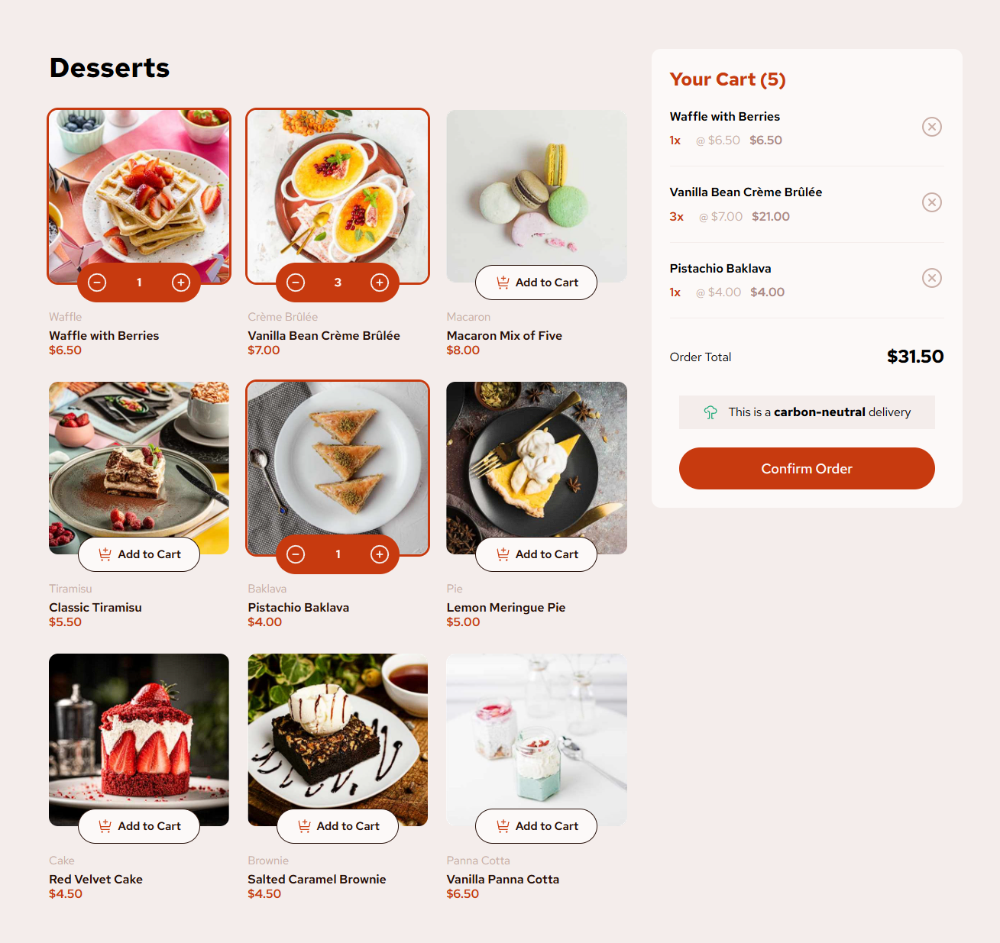
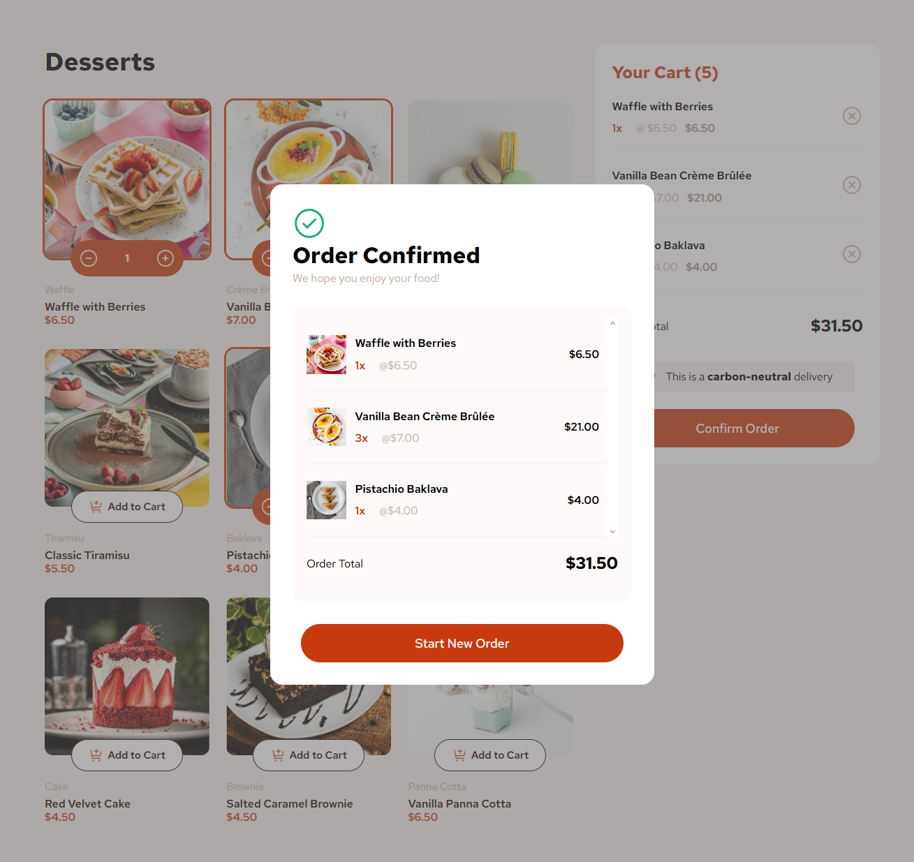

# Frontend Mentor - Product list with cart solution

This is my solution to the [Product list with cart challenge on Frontend Mentor](https://www.frontendmentor.io/challenges/product-list-with-cart-5MmqLVAp_d).

## Table of contents

- [Overview](#overview)
  - [The challenge](#the-challenge)
  - [Screenshot](#screenshot)
  - [Links](#links)
- [My process](#my-process)
  - [Built with](#built-with)
  - [What I learned](#what-i-learned)
  - [Continued development](#continued-development)
  - [Useful resources](#useful-resources)
- [Author](#author)

## Overview

### The challenge

Users should be able to:

- Add items to the cart and remove them
- Increase/decrease the number of items in the cart
- See an order confirmation modal when they click "Confirm Order"
- Reset their selections when they click "Start New Order"
- See hover and focus states for all interactive elements on the page

DEV NOTE (11/12/2025) : I decided not to do the mobile phone version for this one as I'm solely focusing on developing my React.js skills. However, I do plan on doing it for some later time (which is why I added a date on the note title).

### Screenshot

### Links

DEV NOTE (11/12/2025) : I have not yet build the react app since I'm still currently learning on how to do it.

DEV NOTE (31/12/2025) : I finally decided to build this app with vite. I probably should have done that before 😅.

Soon : [Live Site](https://product-list-with-vite.netlify.app/)

<!-- - Solution URL: [Add solution URL here](https://your-solution-url.com)
- Live Site URL: [Add live site URL here](https://your-live-site-url.com) -->

## My process

### Built with

- Semantic HTML5 markup
- CSS custom properties
- Flexbox
- CSS Grid
- [React](https://reactjs.org/) - JS library

### What I learned

- **States behaviour and state management** : When using React.js, I've learned that knowing how states are used and rendered is crucial for developing applications, not only how to use but also when to make one. It took me 2 weeks to learn these lessons and applying it I noticed that it only took me 2-3 days to complete the render "logic" part of this small project.

- **Components composition vs prop drilling** : When I was learning React.js, I was learning it through a course and one of many things that stuck with me is how and when to use component composition and prop drilling. Honestly, I feel like it's a developer-preference but for me I like compositing my components as it not only looks structured but also makes sense and actually easier to use than prop drilling. That does not mean I didn't use prop drilling, it's very apparent in my code that I utilized it a lot as much as using component composition.

- **A cool transition to traditional separate of concerns (HTML, CSS, and JavaScript) to JSX** : As someone that creates static web apps through traditional developing experience (writing HTML, CSS, JS) I had a weird feeling at first when writing JSX as I was not familiar with it. However as I wrote more code, I noticed how convenient it was writing JSX code as I was able to just write code in one single JS file rather than with HTML, CSS, and JS for each of separate of concerns dealing with creating static web apps.

### Continued development

**Reducing too many small components for less complexity and more on readability and developer experience** : As I write the program for this small project, I noticed that I've built too many small components that are not even reused in some other parts of the web application. So, I might do some other small projects to practice my way of writing a program that leans toward readability and developer experience than applying complexity since this type of lesson are only realized through experience.

**Progressing through a React.js course** : I'm actually doing a React.js course from Jonas Schmedtmann on Udemy and his course is such a big help for learning and getting some practical advises on things not only about React.js but also programming in general. Right now, I'm on learning Data fetching, custom hooks, etc.

## Author

- Frontend Mentor - [@SoftPillow20](https://www.frontendmentor.io/profile/SoftPillow20)
